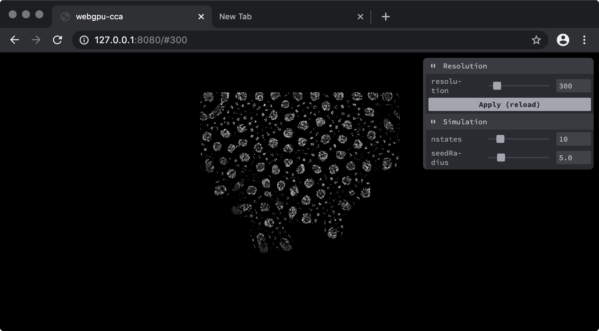
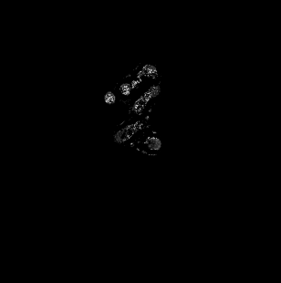

# WebGPU Compute Cellular Automata

Experiment implementtation of Multiple Neighborhoods Cellular Automata using WebGPU





## Run

### Chrome Canary

This code is using WebGPU API, and was tested on Chrome Canary 98.0.4722.0 macOS.

Install Chrome Canary.

Turn on `#enable-unsafe-webgpu` via `chrome://flags` on Chrome Canary.

[Live demo](https://dawidgorny.github.io/webgpu-cca/dist/)

## Build

```
yarn install
```

```
npm run start-dev
```

## References

- [Softology - Multiple Neighborhoods Cellular Automata](https://softologyblog.wordpress.com/2018/03/09/multiple-neighborhoods-cellular-automata/)
- [SyntheticSearchSpace /
  WebGL-Automata](https://github.com/SyntheticSearchSpace/WebGL-Automata/tree/master/WebGL-Automata/glsl)
- [@psychobiotik - Intro to Compute Shaders](https://paprika.studio/workshops/compute/index.html)

## License

MIT
